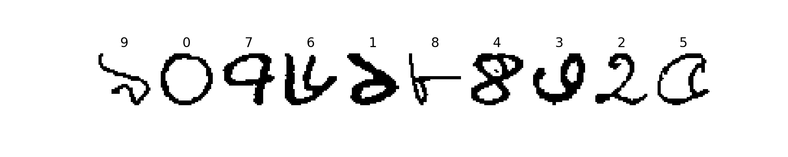
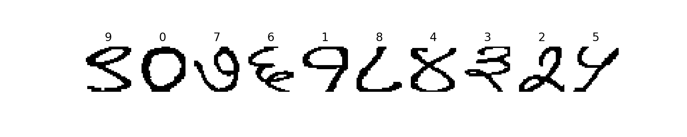
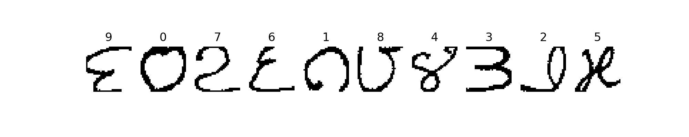

# CMATERdb
Easy to use CMATERdb datasets converted in NumPy format

[](http://www.apache.org/licenses/LICENSE-2.0)

## About
CMATERdb is the pattern recognition database repository created at the ‘Center for Microprocessor Applications for Training Education and Research’ (CMATER) research laboratory, Jadavpur University, Kolkata 700032, INDIA. This database is free for all non-commercial uses. Please acknowledge CMATER explicitly, whenever you use this database for academic and research purposes. For using some databases, one must also cite relevant research publications, mentioned in this website.

**Official Dataset Repository**: [Link](https://code.google.com/archive/p/cmaterdb/)  
**Shifted Repository as per Google Code Archive (Not Live)**: [Link](http://www.cmaterju.org/cmaterdb.htm)

## Citing CMATERdb 3: Handwritten Indian script character database

If you use any of the CMATERdb datasets in your work, we would appreciate a reference to authors' original papers:
```
@article{Das:2012:GAB:2161007.2161320,
  author = {Das, Nibaran and Sarkar, Ram and Basu, Subhadip and Kundu, Mahantapas 
            and Nasipuri, Mita and Basu, Dipak Kumar},
  title = {A Genetic Algorithm Based Region Sampling for Selection of Local Features 
          in Handwritten Digit Recognition Application},
  journal = {Appl. Soft Comput.},
  issue_date = {May, 2012},
  volume = {12},
  number = {5},
  month = may,
  year = {2012},
  issn = {1568-4946},
  pages = {1592--1606},
  numpages = {15},
  url = {http://dx.doi.org/10.1016/j.asoc.2011.11.030},
  doi = {10.1016/j.asoc.2011.11.030},
  acmid = {2161320},
  publisher = {Elsevier Science Publishers B. V.},
  address = {Amsterdam, The Netherlands, The Netherlands},
  keywords = {Feature selection, Genetic algorithm, N-Quality consensus, 
  Optimal local regions, Region sampling, Variable sized local regions},
}
```
```

@article{Das:2012:SFC:2240301.2240421,
  author = {Das, Nibaran and Reddy, Jagan Mohan and Sarkar, Ram and Basu, Subhadip and Kundu, 
            Mahantapas and Nasipuri, Mita and Basu, Dipak Kumar},
  title = {A Statistical-topological Feature Combination for Recognition of Handwritten Numerals},
  journal = {Appl. Soft Comput.},
  issue_date = {August, 2012},
  volume = {12},
  number = {8},
  month = aug,
  year = {2012},
  issn = {1568-4946},
  pages = {2486--2495},
  numpages = {10},
  url = {http://dx.doi.org/10.1016/j.asoc.2012.03.039},
  doi = {10.1016/j.asoc.2012.03.039},
  acmid = {2240421},
  publisher = {Elsevier Science Publishers B. V.},
  address = {Amsterdam, The Netherlands, The Netherlands},
  keywords = {Character recognition, Feature combination, MPCA, PCA, SVM, Statistical, Topological},
}
```

## News and Updates

**IMPORTANT** 
News coming for Tensorflow developers!

## The Dataset
- **CMATERdb 3.1.1: Handwritten Bangla numeral database** is a balanced dataset of total 6000 Bangla numerals (32x32 RGB coloured, 6000 images), each having 600 images per classs(per digit).

- **CMATERdb 3.2.1: Handwritten Devanagari numeral database** is a balanced dataset of total 3000 Bangla numerals (32x32 RGB coloured, 3000 images), each having 300 images per classs(per digit).

- **CMATERdb 3.4.1: Handwritten Telugu numeral database** is a balanced dataset of total 3000 Bangla numerals (32x32 RGB coloured, 3000 images), each having 300 images per classs(per digit).


## Get the data
Script to download images and easy to use functions are on the way!

### CMATERdb 3.1.1: Handwritten Bangla numeral database
| File                        | Examples |  Download (NumPy format)        |
|-----------------------------|----------|---------------------------------|
| Training images with labels | 5000     | [training-images.npz](https://github.com/prabhuomkar/CMATERdb/raw/master/datasets/bangla-numerals/training-images.npz) (700KB) |
| Testing images with labels  | 1000     | [testing-images.npz](https://github.com/prabhuomkar/CMATERdb/raw/master/datasets/bangla-numerals/testing-images.npz) (141KB)  |

### CMATERdb 3.2.1: Handwritten Devanagari numeral database
| File                        | Examples |  Download (NumPy format)        |
|-----------------------------|----------|---------------------------------|
| Training images with labels | 2500     | [training-images.npz](https://github.com/prabhuomkar/CMATERdb/raw/master/datasets/devanagari-numerals/training-images.npz) (347KB) |
| Testing images with labels  | 500      | [testing-images.npz](https://github.com/prabhuomkar/CMATERdb/raw/master/datasets/devanagari-numerals/testing-images.npz) (70KB)   |

### CMATERdb 3.4.1: Handwritten Telugu numeral database
| File                        | Examples |  Download (NumPy format)        |
|-----------------------------|----------|---------------------------------|
| Training images with labels | 2500     | [training-images.npz](https://github.com/prabhuomkar/CMATERdb/raw/master/datasets/telugu-numerals/training-images.npz) (338KB) |
| Testing images with labels  | 500      | [testing-images.npz](https://github.com/prabhuomkar/CMATERdb/raw/master/datasets/telugu-numerals/testing-images.npz) (68KB)   |

## License
Both the dataset itself and the contents of this repo are licensed under [Apache 2.0 License](LICENSE.md) as given [here](https://code.google.com/archive/p/cmaterdb/).
